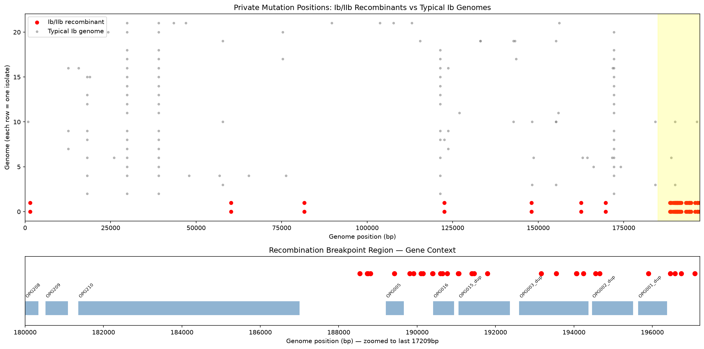
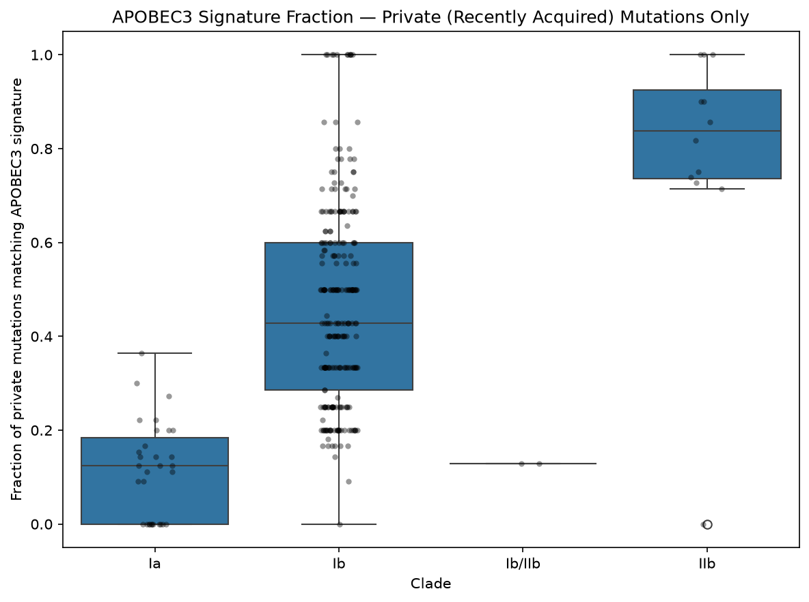
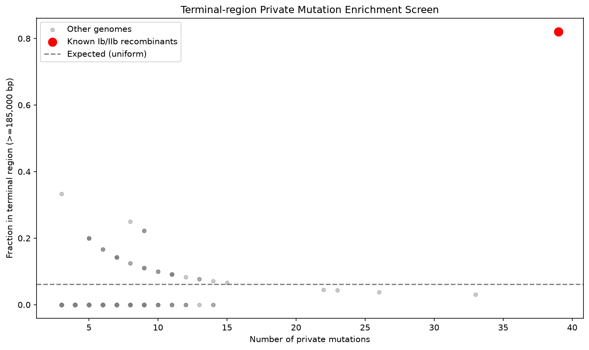

# Mpox Genomic Surveillance Pipeline

A genomic surveillance pipeline for Monkeypox virus (MPXV) covering clade classification, mutation hotspot analysis, APOBEC3 signature characterization, and recombination breakpoint screening.

## Key Figures

### Recombination Breakpoint Map

### APOBEC3 Signature Analysis (Private Mutations)

### Recombinant Genome Screen

## Key Findings

### 1. Clade Distribution (300 recent MPXV genomes, Aug 2024 - Feb 2025)

- Clade Ib: 253 genomes (84%)
- Clade Ia: 31 genomes
- Clade IIb: 14 genomes
- Clade Ib/IIb (inter-clade recombinant): 2 genomes

### 2. Validation of WHO-Confirmed Ib/IIb Recombinant

Two genomes (OZ478275.1 and OZ478273.1, Puducherry, India, September 2025) correctly classified as the Ib/IIb recombinant clade — corresponding to the WHO-confirmed inter-clade recombinant mpox case (Pullan et al., 2025, virological.org). Pipeline independently reproduced correct classification using public NCBI data.

### 3. Recombination Breakpoint Mapping

82% of private mutations in recombinant genomes concentrated in terminal 12kb (positions 185,000-197,209), overlapping the inverted terminal repeat (ITR) region. Consistent with block recombination at the structurally variable ITR.

### 4. Recombinant Screening — No Additional Cases Detected

Binomial test for terminal-region private mutation enrichment applied to all 300 genomes. Known recombinants: p=2.17e-32. All other 294 genomes: no candidates at p<0.05 (median terminal fraction = 0).

### 5. APOBEC3 Signature (Private Mutations Only)

- IIb: 84% — heavy editing, consistent with 2022+ sustained human transmission
- Ib: 46% — moderate editing, DRC/Uganda transmission chains
- Ia: 11% — low, consistent with zoonotic spillover
- Ib/IIb recombinant: 13% — matches Ia level, not Ib, supporting block transfer not accumulated edits

## Pipeline

1. fetch_mpox_genomes.py — NCBI Entrez genome fetch with metadata
2. Nextclade CLI v3.21 — clade classification and phylogenetic placement
3. analyze_mutations.py — genome-wide hotspot analysis, APOBEC3 screening
4. recombination_analysis.py — private mutation analysis, breakpoint mapping
5. finalize_analysis.py — refined APOBEC3 comparison, phylogenetic placement
6. screen_recombinants.py — statistical screen for additional recombinant candidates

## Tech Stack

- Data: NCBI Entrez (Biopython)
- Clade classification: Nextclade CLI v3.21, Nextstrain Mpox all-clades dataset
- Analysis: Python, pandas, numpy, scipy, Biopython
- Visualization: matplotlib, seaborn

## Local Setup

git clone https://github.com/usamamanzoor1121-pixel/mpox-genomic-surveillance.git
cd mpox-genomic-surveillance
conda create -n mpox-surveillance python=3.11 -y
conda activate mpox-surveillance
pip install -r requirements.txt
python scripts/fetch_mpox_genomes.py
./nextclade dataset get --name nextstrain/mpox/all-clades --output-dir data/raw/mpox_dataset
./nextclade run --input-dataset data/raw/mpox_dataset --output-all nextclade_output/ data/raw/mpox_genomes.fasta
python scripts/analyze_mutations.py
python scripts/recombination_analysis.py
python scripts/finalize_analysis.py
python scripts/screen_recombinants.py

## Author

Usama Manzoor
JSMU Diagnostic Laboratory and Blood Bank, Karachi, Pakistan
GitHub: https://github.com/usamamanzoor1121-pixel
LinkedIn: https://www.linkedin.com/in/usama-manzoor-042595182/
